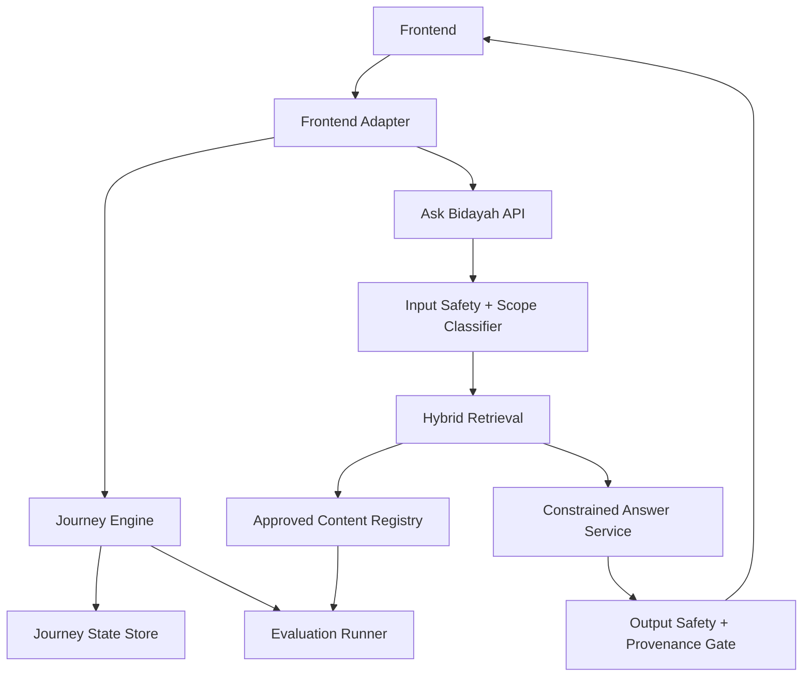

# System Architecture

## Target Shape

## Runtime Responsibilities

### Frontend

- Render current journey state.
- Show mode distinction clearly:
  - Do Now = prepare before prayer.
  - Learn First = practice/review before prayer.
- Never position Bidayah as live prayer guidance.
- Call service interfaces rather than owning religious logic.

### Journey Engine

- Pure deterministic state machine.
- Owns all step transitions.
- Owns prerequisite checks.
- Owns mode behavior.
- Emits `JourneyState`.
- Does not call an LLM.

### Content Registry

Stores:

- `Source`
- `AtomicStep`
- `KnowledgeItem`
- `GlossaryItem`
- `Claim`
- `ReviewStatus`
- source coverage notes

Only approved records are eligible for verified answers.

### Retrieval Service

- Receives question + journey state.
- Searches approved content only.
- Uses filters before ranking:
  - journey
  - stage
  - step
  - language
  - review status
  - source allowlist
- Returns claim-level evidence, not loose paragraphs.

### Answer Service

- Generates concise beginner responses from retrieved evidence.
- Must return structured output.
- Must include source IDs and claim IDs.
- Must not add unsupported details.

### Safety Gate

Blocks or escalates:

- unsupported religious claims
- personal medical/legal-like fasting cases
- complex travel cases
- broad fatwa requests
- prompt injection attempts
- requests to ignore approved sources
- any request to use arbitrary web results as religious evidence

## Data Flow for Ask Bidayah

1. User asks a question.
2. Current `JourneyState` is attached.
3. Scope classifier checks whether the question belongs to First Prayer or First Fast.
4. Retrieval searches approved content.
5. Sufficiency check decides whether evidence supports an answer.
6. Answer service returns structured answer or refusal.
7. Safety gate verifies that every religious claim maps to approved claim IDs.
8. UI displays answer, source chips, and escalation when needed.

## Data Flow for Journey Progress

1. UI sends user action.
2. Journey Engine validates transition.
3. New `JourneyState` is saved.
4. UI renders the next step.
5. Ask Bidayah context automatically changes with the new step.

## Deployment Phases

### Phase 1: Local Modular MVP

- Extract journey engine and content registry from `src/App.tsx`.
- Keep deterministic retrieval.
- Add executable evaluation tests.

### Phase 2: Backend API

- Add server for content, retrieval, evaluation logs, and LLM key isolation.
- Keep frontend thin.

### Phase 3: Real Retrieval

- Add hybrid retrieval and embeddings.
- Add claim-level provenance.
- Add regression gates.

### Phase 4: Constrained LLM

- Add structured answer generation.
- Keep deterministic fallback.
- Require passing safety/eval gates before release.
